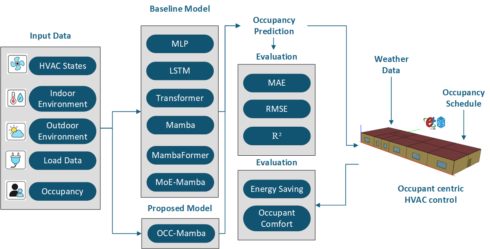

# OCC-Mamba

A Mamba-based deep learning model for indoor occupancy prediction.  
This repository contains the official implementation of the paper:

**OCC-Mamba: A Lightweight and Robust Deep Learning Approach for Occupancy Prediction in Smart Buildings**

---

<p align="center">
  
</p>

---

## Introduction

This study introduces **OCC-Mamba**, a lightweight yet powerful deep learning model **tailored for building occupancy prediction**.  
By capturing both long-term trends and short-term dynamics, OCC-Mamba outperforms baseline models including MLP, LSTM, Transformer, and Mamba variants across **Honeycomb, ROBOD, and ASHRAE datasets**, while enabling **energy-efficient HVAC control in EnergyPlus simulations**.

If you find this project helpful, please give us a ⭐ — your support is our greatest motivation.

---

## Installation

### Dependencies
- Windows / Linux / macOS  
- Python 3.8+  
- Required Python packages:  
  - `pandas`  
  - `numpy`  
  - `scikit-learn`  
  - `matplotlib`  
  - `torch`  
  - `tqdm`  

### Environment Installation
We recommend using **Miniconda** to manage your Python environment.

**Step 0:** Install [Miniconda](https://docs.conda.io/en/latest/miniconda.html)

**Step 1:** Create and activate a virtual environment
```bash
conda create -n occ_mamba python=3.8 -y
conda activate occ_mamba

```
**Step 2:** Install dependencies

```bash
pip install pandas numpy scikit-learn matplotlib torch tqdm
```

**Step 3:** Clone the Repository
```bash
git clone https://github.com/irfanqaisar92/OCCMamba.git
cd OCCMamba
```
**Step 4:** Run the Framework
Use the provided orchestrator script to execute the full pipeline (preprocessing → baselines → OCC-Mamba → aggregation):

```bash
python Code/run_all.py
```
Or train OCC-Mamba directly:

```bash
python Code/train_occu_mamba.py
```

## Acknowledgements
This repository contains the code implementation of the paper  
[_OCC-Mamba: A Lightweight and Robust Deep Learning Approach for Occupancy Prediction in Smart Buildings_](https://github.com/irfanqaisar92/OCCMamba),  
developed using heterogeneous real-world datasets (Honeycomb, ROBOD, ASHRAE 10) and validated through EnergyPlus simulations for occupant-centric HVAC control.


## Contact Us
If you have any further inquiries ❓, don't hesitate to get in touch with us 👨‍💻👩‍💻  
- Maintainer: [Irfan Qaisar](https://github.com/irfanqaisar92)  
- Issues & Contributions: Please open a [GitHub Issue](https://github.com/irfanqaisar92/OCCMamba/issues) or a Pull Request.  

## Citation
This paper will be submitted for publication.  
The official citation format will be provided once available.  


## Contact Us

If you have any further inquiries ❓, don't hesitate to get in touch with us 👨‍💻👩‍💻
